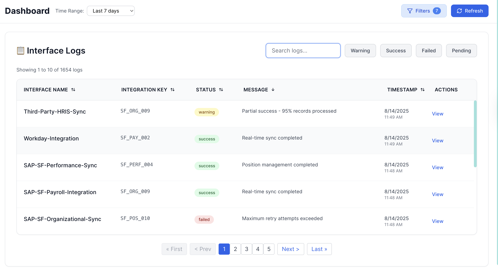
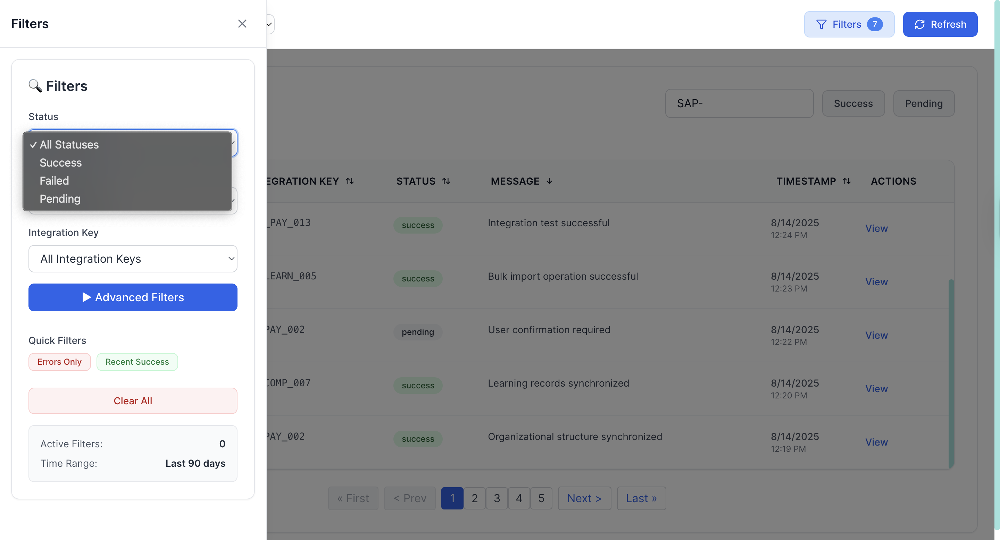
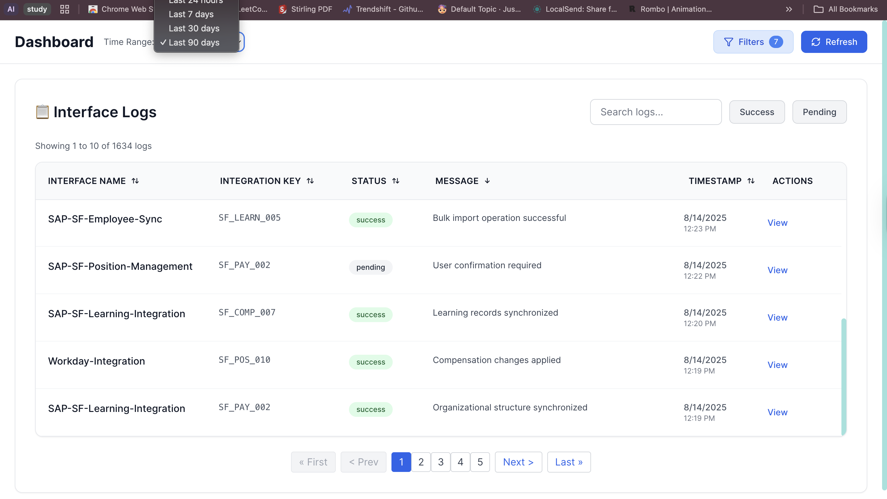
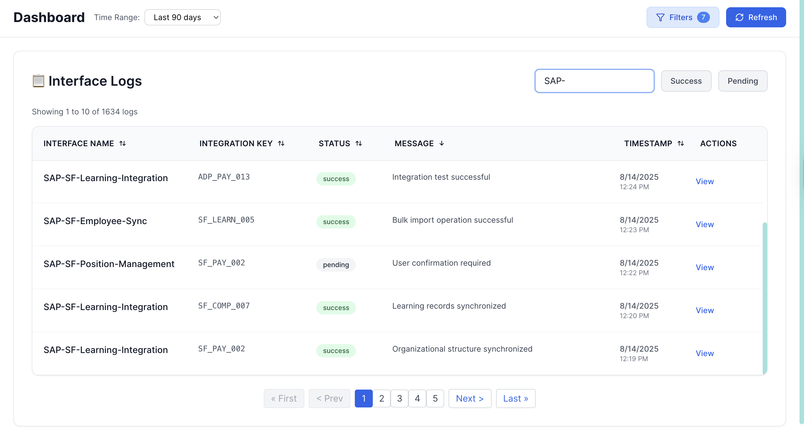
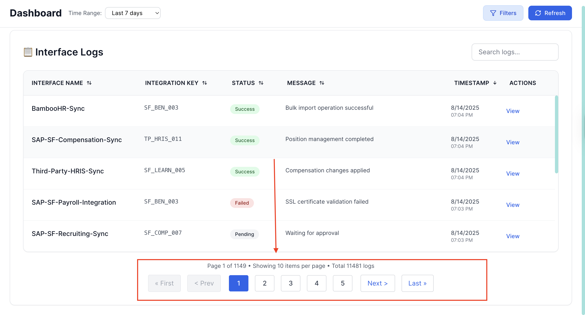
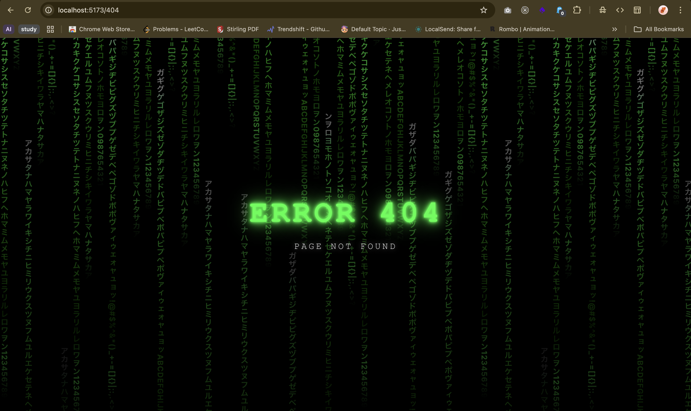

# ConnexView - Interface Monitoring Dashboard

A modern, real-time interface monitoring dashboard for HR integrations built with React and styled-components.

## 🎯 Project Overview

ConnexView is a web-based Interface Monitoring Dashboard designed to help users visualize the health and history of data replication interfaces between systems like SAP SuccessFactors and downstream applications (SAP ECP, 3rd party apps).


## 📸 Screenshots

### Dashboard Home View


### Filter Options


### Time Filtering


### Search Feature


### Pagination


### 404 - Unknown Routes



# ✨ Key Features


### 📋 Live Interface Logs Table
- **Comprehensive Fields**: Interface Name, Integration Key, Status, Message, Timestamp
- **Advanced Filtering**: Filter on every column with global search
- **Smart Indicators**: Color-coded status badges and severity levels
- **Pagination**: Efficient handling of large datasets
- **Sorting**: Multi-column sorting capabilities

### 🎛️ Advanced Filters & Controls
- **Dynamic Filtering**: Real-time filter application
- **Preset Filters**: Quick access to common filter combinations
- **Filter Chips**: Visual representation of active filters
- **Time-based Controls**: Flexible time range selection

## 🛠️ Technical Architecture

### Frontend Stack
- **React 19**: Latest React with hooks and modern patterns
- **Styled-components**: CSS-in-JS for dynamic styling
- **Vite**: Fast build tool and development server

### Component Structure
```
src/
├── api/
│   └── api.js                 # API service layer with caching
├── components/
│   └── DashBoard/
│       ├── Home.jsx           # Dashboard summary component
│       ├── LogsTable.jsx      # Interface logs table
│       ├── Filters.jsx        # Advanced filtering component
│       ├── Notifications.jsx  # Real-time notifications
│       └── Loader.jsx         # Loading states & skeletons
├── pages/
│   └── DashboardPage.jsx      # Main dashboard page
└── App.jsx                    # Root component with error boundary
```

### Performance Optimizations

#### 🚀 Frontend Optimizations
- **React.memo & useMemo**: Prevent unnecessary re-renders
- **Debounced Search**: Optimized search input handling
- **Virtual Scrolling Ready**: Prepared for infinite scroll implementation
- **Lazy Loading**: Component-level code splitting
- **Caching Strategy**: API response caching with TTL

#### 📡 API Layer Features
- **Request Caching**: 5-minute cache for GET requests
- **Error Handling**: Comprehensive error management
- **Retry Logic**: Automatic retry for failed requests
- **Performance Monitoring**: Request timing and metrics


## 🔧 Setup Instructions

### Prerequisites
- Node.js 18+ 
- npm or yarn

### Installation
```bash
# Install dependencies
npm install

# Start development server
npm run dev

# Build for production
npm run build

# Preview production build
npm run preview
```

### Environment Configuration
Create a `.env` file in the root directory:
```env
VITE_API_URL=http://localhost:5000/api
VITE_APP_NAME=ConnexView
VITE_REFRESH_INTERVAL=30000
```

## 🔌 Backend Integration

### Expected API Endpoints

#### Dashboard Summary
```
GET /api/dashboard/summary?timeRange={timeRange}
Response: {
  summary: {
    totalExecutions: number,
    successfulExecutions: number,
    failedExecutions: number
  },
  trends: {
    totalChange: number,
    successChange: number,
    failureChange: number,
    successRateChange: number
  }
}
```

#### Interface Logs
```
GET /api/interfaces/logs?page={page}&limit={limit}&timeRange={timeRange}&status={status}&interfaceName={name}&integrationKey={key}&sortBy={field}&sortOrder={order}
Response: {
  logs: Array<{
    id: string,
    interfaceName: string,
    integrationKey: string,
    status: 'success' | 'failed' | 'pending' | 'warning',
    message: string,
    timestamp: string
  }>,
  totalPages: number,
  currentPage: number,
  totalCount: number
}
```


### Build Optimization
```bash
# Production build
npm run build
```


## 🤝 Contributing

### Development Workflow
1. Feature branch from `main`
2. Implement changes with tests
3. Submit pull request
4. Code review and merge


**Live Demo**: [ConnexView Dashboard](http://localhost:5173)  
**Challenge**: Interface Monitoring Dashboard for HR Integrations
